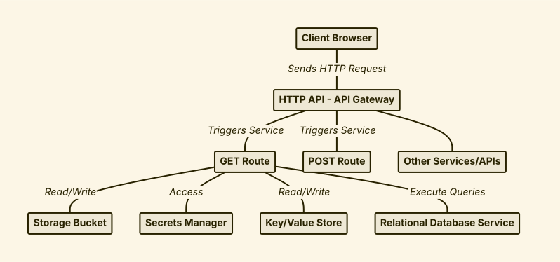
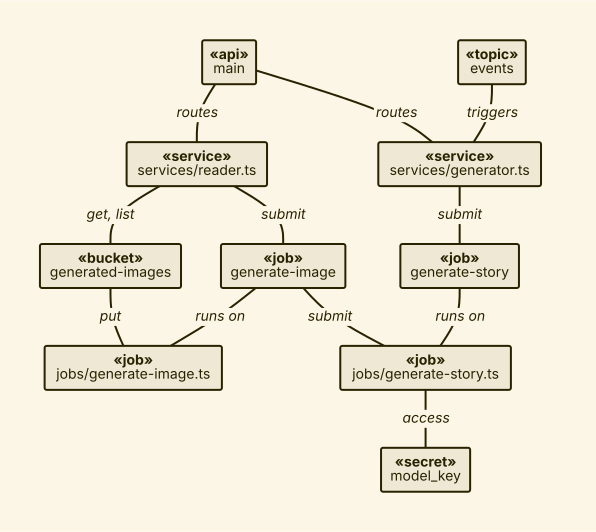

# zodmaid

> [!NOTE]
> This project is in a very early stage of development.

**usage:**

- `git clone https://github.com/hastebrot/zodmaid`
- `cd zodmaid/packages/zodmaid`
- `bun install --linker=isolated`
- `bun run build`
- `bun run test --watch zodmaid`

**examples:**



```ts
const diagram = [
  node(id("browser"), "Client Browser"),
  node(id("api"), "HTTP API - API Gateway"),
  node(id("service"), "GET Route"),
  node(id("service2"), "POST Route"),
  node(id("service3"), "Other Services/APIs"),
  node(id("bucket"), "Storage Bucket"),
  node(id("secrets"), "Secrets Manager"),
  node(id("kvstore"), "Key/Value Store"),
  node(id("rds"), "Relational Database Service"),

  edge(node("browser"), arrow("->"), node("api"), "Sends HTTP Request"),
  edge(node("api"), arrow("->"), node("service"), "Triggers Service"),
  edge(node("api"), arrow("->"), node("service2"), "Triggers Service"),
  edge(node("api"), arrow("->"), node("service3")),
  edge(node("service"), arrow("->"), node("bucket"), "Read/Write"),
  edge(node("service"), arrow("->"), node("secrets"), "Access"),
  edge(node("service"), arrow("->"), node("kvstore"), "Read/Write"),
  edge(node("service"), arrow("->"), node("rds"), "Execute Queries"),
];
```



```ts
const diagram = [
  node(id("main"), ["«api»", "main"]),
  node(id("events"), ["«topic»", "events"]),
  node(id("services/reader.ts"), ["«service»", "services/reader.ts"]),
  node(id("services/generator.ts"), ["«service»", "services/generator.ts"]),
  node(id("generated-images"), ["«bucket»", "generated-images"]),
  node(id("generate-image"), ["«job»", "generate-image"]),
  node(id("generate-story"), ["«job»", "generate-story"]),
  node(id("jobs/generate-image.ts"), ["«job»", "jobs/generate-image.ts"]),
  node(id("jobs/generate-story.ts"), ["«job»", "jobs/generate-story.ts"]),
  node(id("model_key"), ["«secret»", "model_key"]),

  edge(node("main"), arrow("->"), node("services/reader.ts"), "routes"),
  edge(node("main"), arrow("->"), node("services/generator.ts"), "routes"),
  edge(node("events"), arrow("->"), node("services/generator.ts"), "triggers"),

  edge(node("services/reader.ts"), arrow("->"), node("generated-images"), "get, list"),
  edge(node("services/reader.ts"), arrow("->"), node("generate-image"), "submit"),
  edge(node("services/generator.ts"), arrow("->"), node("generate-story"), "submit"),

  edge(node("generated-images"), arrow("->"), node("jobs/generate-image.ts"), "put"),
  edge(node("generate-image"), arrow("->"), node("jobs/generate-image.ts"), "runs on"),
  edge(node("generate-image"), arrow("->"), node("jobs/generate-story.ts"), "submit"),
  edge(node("generate-story"), arrow("->"), node("jobs/generate-story.ts"), "runs on"),

  edge(node("jobs/generate-story.ts"), arrow("->"), node("model_key"), "access"),
];
```
