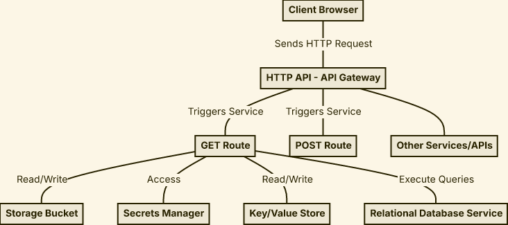

# zodmaid



```ts
const diagram = [
  node(id("browser"), "Client Browser"),
  node(id("api"), "HTTP API - API Gateway"),
  node(id("service"), "GET Route"),
  node(id("service2"), "POST Route"),
  node(id("service3"), "Other Services/APIs"),
  node(id("bucket"), "Storage Bucket"),
  node(id("secrets"), "Secrets Manager"),
  node(id("kvstore"), "Key/Value Store"),
  node(id("rds"), "Relational Database Service"),

  edge(node("browser"), arrow("->"), node("api"), "Sends HTTP Request"),
  edge(node("api"), arrow("->"), node("service"), "Triggers Service"),
  edge(node("api"), arrow("->"), node("service2"), "Triggers Service"),
  edge(node("api"), arrow("->"), node("service3")),
  edge(node("service"), arrow("->"), node("bucket"), "Read/Write"),
  edge(node("service"), arrow("->"), node("secrets"), "Access"),
  edge(node("service"), arrow("->"), node("kvstore"), "Read/Write"),
  edge(node("service"), arrow("->"), node("rds"), "Execute Queries"),
];
```

**usage:**

- `git clone https://github.com/hastebrot/zodmaid`
- `cd zodmaid/packages/zodmaid`
- `bun install`
- `bun run test --watch zodmaid`
